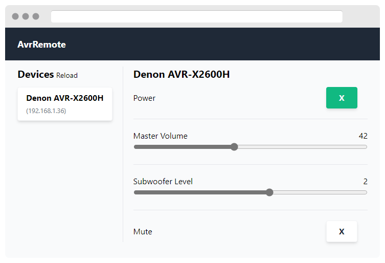

# AvrRemote


Web UI to control your AVR (only Denon is supported).



## Technologies
* .NET 6
* ASP.NET Core 6
* Blazor WebAssembly
* TailwindCSS

## Deploy
**appsettings.json**
```json
{
}
```

**docker-compose.yml**
```yaml
version: '3'
services:
  grafana:
    image: ghcr.io/patrick-b6n/avr-remote:latest
    container_name: http-to-web-push
    restart: always
    volumes:
      - ${PWD}/appsettings.json:/app/appsettings.json
```

## Development

**Backend**
```shell
cd ./src/AvrRemote.Server/
dotnet watch
```

**Frontend**
```shell
cd ./src/AvrRemote.UI/wwwroot/
yarn watch  # watch for css changes 
```

## Docs
* Denon Control Protocol (rev. 2020-07-29)
  * http://assets.denon.com/_layouts/15/xlviewer.aspx?id=/DocumentMaster/us/FY21AVR_DENON_PROTOCOL_02092020.xlsx

## TODO
* fix telnet glitches
